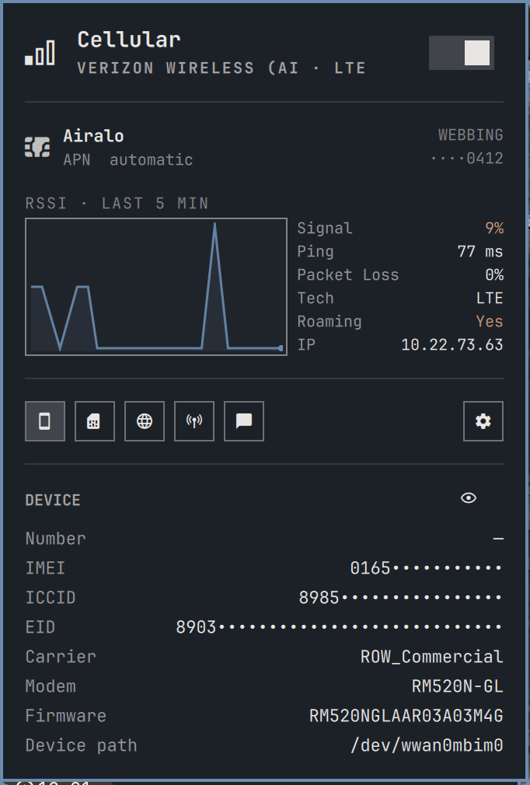
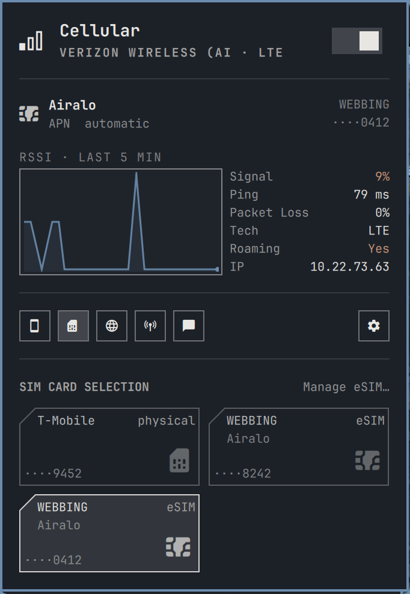
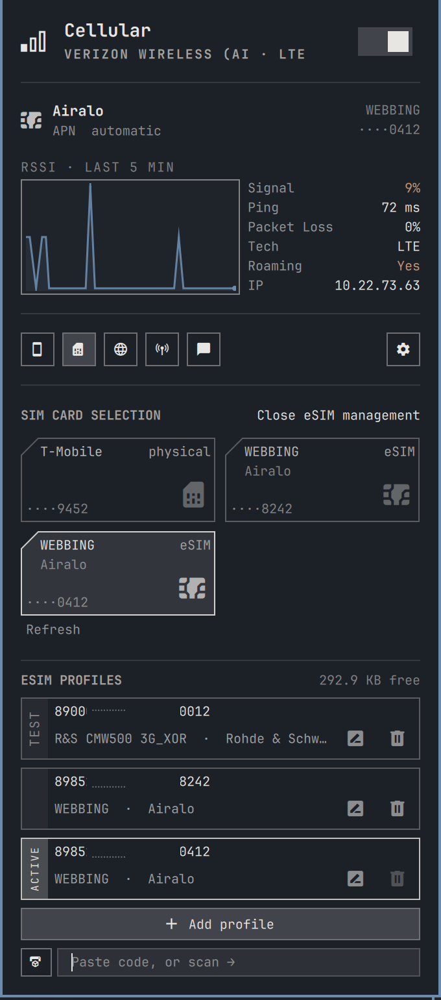
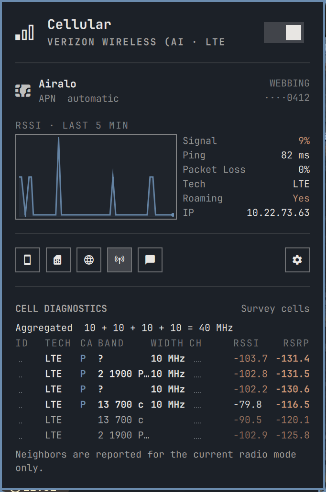
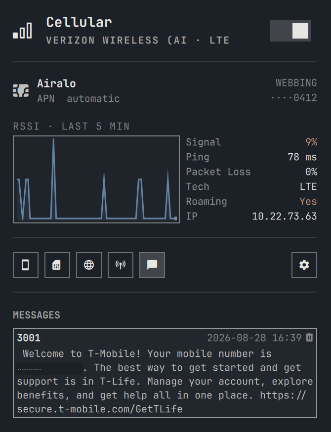
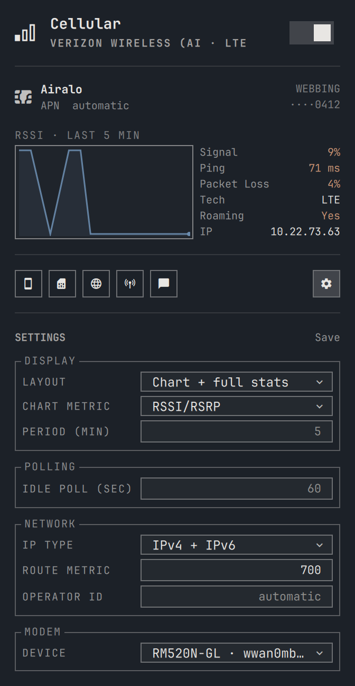
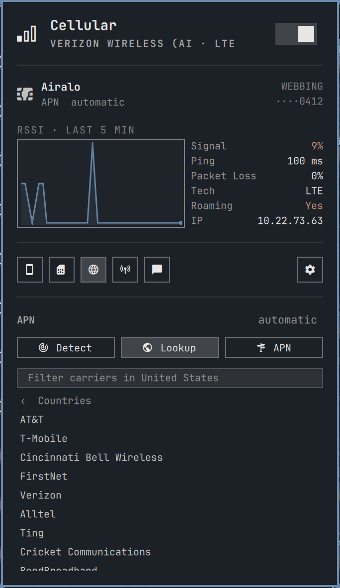

# omarchy-cellular

A Cellular (WWAN/Mobile Data) plugin for [Omarchy](https://omarchy.org/): a bar
widget with a control panel and a CLI for LTE and 5G modems, SIM cards and eSIM
profiles, APN and carrier settings, per-card data plans, text messages, and cell
diagnostics. Wi-Fi-grade ease of use for the cellular modem in the tray.

NetworkManager and ModemManager do the work of managing the modem, read over the bus;
lpac handles eSIM profiles and qmicli the deep diagnostics, each through its proxy on
the modem's own control port.

<p align="center">
<br>
<sub>The panel: active card, connection stats, signal history, data meter, radio mode.</sub>
</p>

## Install

```sh
omarchy plugin add https://github.com/relctx/omarchy-cellular.git
omarchy plugin enable relctx.cellular --section right
```

`~/.config/omarchy/cellular.conf` is created on first use.

To put the CLI on `PATH`:

```sh
ln -sf ~/.config/omarchy/plugins/relctx.cellular/bin/omarchy-cellular ~/.local/bin/
```

## Requirements

Omarchy 4.0 (quattro) or newer. The widget targets the Quickshell-based omarchy-shell.

eSIM profile management needs lpac built with the driver matching the modem's
control port: `mbim` normally, `qmi` for modems that expose only a QMI port.
The `lpac-git` package has both, the stock `lpac` package has neither:

```sh
yay -S lpac-git
omarchy pkg add zbar        # QR scan; codes can still be typed without it
```

`lpac` talks to the eUICC over the modem's control port (MBIM or QMI, matching what
the modem exposes), which ModemManager keeps open, so eSIM operations do not interrupt
the connection. `qmicli` and `mbimcli` ship with libqmi and libmbim, which
ModemManager depends on, so the diagnostics need nothing extra. `omarchy-cellular doctor` reports
what is installed.

## Hardware



Developed against a Lenovo ThinkPad X1 Carbon Gen 12 with a Quectel RM520N-GL (5G,
MHI/PCIe). USB modems should work, but have not been tested.

Two code paths depend on the hardware. Control-port discovery reads the captured
modem's own port list, MBIM preferred, with a `/sys/class/wwan` scan
only as the fallback while the modem object is absent. Control-port recovery after
suspend re-authorizes the USB device to force a re-probe, and returns early on PCIe,
where there is no `cdc-wdm` node.

<br clear="both">

## Panel



The bar icon opens the control panel. Right-click toggles cellular, middle-click
refreshes.

The panel is event-driven: ModemManager and NetworkManager signals update it as they
happen, and a SIM switch reports each stage instead of holding one spinner.

- **Connect switch**, operator, technology, status.
- **Active identity**: which card and which APN are active.
- **Connection stats and chart**: signal metrics colored at their 3GPP thresholds,
  ping, packet loss, throughput, totals, IP. Click a value to copy it. A sparkline
  charts RSSI/RSRP, SNR, or signal quality over a chosen window.
- **Data usage**: a per-card meter. A tick marks where today falls in the billing
  period, the counting start is stamped, and the cutoff is a switch.
- **Radio mode**: auto, 5G, 4G, 3G.
- **Management chips**: device details, SIM cards, APN and carrier, cell diagnostics,
  messages. One box opens at a time. Settings sits apart on the right.

The bar widget's own settings (default poll interval, sparkline enable, message
notifications) are in Omarchy's bar widget settings; a `tune` value overrides where
both exist.

<br clear="both">

### SIM cards and eSIM profiles



Every card the modem can use appears as a tile: the physical card and each eSIM
profile. One click switches; the CLI decides whether that means a slot switch, a
profile enable, or both. eSIM management lists profiles by full ICCID with rename,
delete, and install by activation code or on-screen QR scan, and shows the eUICC's
free space. Operations run over the modem's control port with the connection up, and
one authorization covers a whole management session.

```sh
omarchy-cellular sims                    # every card, one per line
omarchy-cellular use 8985235...          # switch to that card
omarchy-cellular profile list
omarchy-cellular profile enable 8985235...
omarchy-cellular profile download 'LPA:1$...'
```

<br clear="both">

### Cell diagnostics



Read on demand behind one authorization, never polled. The table lists every carrier
in use (the primary and each activated secondary with its width, carrier aggregation
totaled) and then every cell the radio hears, strongest first. Neighbors are reported
for the current radio mode only.

```sh
omarchy-cellular cells                   # the same table, in the terminal
omarchy-cellular signal                  # every metric the modem reports
```

<br clear="both">

### Messages



Carrier texts are read, deleted, and announced as notifications when they arrive.
Balance notices, activation confirmations, and roaming warnings are most of what a
data SIM receives. The store is the modem's own memory, so it is shared by every
card in the modem.

```sh
omarchy-cellular sms                     # read stored messages
omarchy-cellular sms delete 3
```

<br clear="both">

### Settings



Grouped, and staged: changes apply when Save is clicked. Display holds the layout
preset (full stats, a condensed grid, a split chart-beside-stats view, chart only,
stats only, or hidden), the chart metric, and the chart period. Polling holds the
idle fallback poll. Network holds IP type, route metric, and operator ID. Modem
selects which device the plugin drives on a machine with more than one. The form
reads and writes `cellular.conf`; the `tune` verb is the same interface from the
terminal.

```sh
omarchy-cellular tune stats compact      # the split chart view
omarchy-cellular tune spark-metric snr
omarchy-cellular tune interval 120
```

<br clear="both">

## Commands

```
omarchy-cellular status              modem, operator, signal, IP
omarchy-cellular connect|disconnect  bring cellular up or down
omarchy-cellular toggle
omarchy-cellular restart             reconnect
omarchy-cellular mode [auto|5g|4g|3g]
omarchy-cellular sims                every card this modem can be
omarchy-cellular use <iccid>         become one: slot switch, profile enable, or both
omarchy-cellular sim [<n>|physical|esim]
omarchy-cellular profile list        profiles on the eSIM
omarchy-cellular profile enable|delete|nickname <iccid> [name]
omarchy-cellular profile download <activation-code>
omarchy-cellular profile scan        install from a QR code on screen
omarchy-cellular carrier ...         carrier and APN selection
omarchy-cellular limit ...           data cap with auto-cutoff
omarchy-cellular apn <name>          set the APN
omarchy-cellular apn list            APNs on the carrier's bearers
omarchy-cellular pin ...             SIM lock: status, unlock, puk, on|off, change
omarchy-cellular signal              every metric the modem reports, RSRQ included
omarchy-cellular cells               carriers in use and every cell heard
omarchy-cellular sms [delete <id>]   read or delete stored text messages
omarchy-cellular devices             every modem present; * marks the one driven
omarchy-cellular device <port|auto>  drive one modem, disable the rest
omarchy-cellular tune <key> [value]  panel tunables: stats (layout preset),
                                     spark-metric, spark-minutes, interval,
                                     ip-type, route-metric, operator-id
omarchy-cellular at '<command>'      one AT command, manual diagnostics only
omarchy-cellular autoconnect on|off
omarchy-cellular prefer [cellular|wifi]  which link carries traffic when both are up
omarchy-cellular metered [yes|no]      whether this connection costs money
omarchy-cellular roaming [yes|no]      allow data on foreign networks
omarchy-cellular identify            re-read ICCID and EID
omarchy-cellular apply               re-read cellular.conf and reconnect
omarchy-cellular config              edit ~/.config/omarchy/cellular.conf
omarchy-cellular log
omarchy-cellular doctor              check the setup
```


## Carrier and APN



APNs come from `mobile-broadband-provider-info`, the database NetworkManager's own mobile
broadband wizard uses, covering 154 countries. MMS and WAP APNs are filtered out.

```sh
omarchy-cellular carrier auto                  # read MCC/MNC from the SIM and apply its APN
omarchy-cellular carrier list                  # countries
omarchy-cellular carrier list pl               # carriers in Poland
omarchy-cellular carrier list pl Orange        # that carrier's data APNs
omarchy-cellular carrier set pl Orange         # apply APN, username and password
omarchy-cellular apply
```

Username and password are applied for carriers that need them.

<br clear="both">

## Per-card configuration

APN, credentials, PIN, operator and the data plan belong to a card, not the machine.
They live in `~/.config/omarchy/cellular.d/<iccid>.conf`, seeded from detect the first
time a card is seen and applied automatically when the active card changes.
`cellular.conf` keeps machine-wide settings. On a machine with more than
one modem, `DEVICE=` selects which one the plugin drives, by primary port
name (`wwan1mbim0`) or IMEI; unset means the first modem ModemManager
lists. Selecting a modem (`device <port>`, or the panel's picker) disables
the others through ModemManager and moves the NetworkManager profile to
the selected modem's interface; `device auto` re-enables exactly what the
plugin disabled.

## Data limit

A monthly, daily or fixed-length cap with an automatic cutoff. Prepaid bundles sold as
"N days from activation" use `days`, which rolls a window of that length forward from the
start date.

```sh
omarchy-cellular limit 5G                  # cap the period at 5 GB
omarchy-cellular limit day 12              # monthly package renews on the 12th
omarchy-cellular limit days 30             # 30-day bundle, counted from today
omarchy-cellular limit days 30 2026-08-15  # 30-day bundle bought on a past date
omarchy-cellular limit period monthly|daily|days
omarchy-cellular limit                     # usage, period, next reset
omarchy-cellular limit reset               # zero the counter; on days, restart the period
omarchy-cellular limit off                 # disable the cutoff, keep tracking usage
```

Each card runs its own meter against its own plan, accumulated from the interface byte
counters into `~/.local/state/omarchy-cellular/usage.<iccid>`; a delta whose interval
straddled a card switch credits the card that was active. Counters survive reboots,
suspend and interface re-creation. At the limit, cellular disconnects with a
notification; reconnecting by hand (or `limit cutoff off`) suppresses the cutoff
until the period renews.

The meter samples on panel updates, which the event feed drives; a cutoff can overshoot
by whatever transfers between samples.

## Route metrics

Both default routes stay in the table, and the lower metric wins:

```
default via 192.168.1.1  dev wlan0    metric 600   <- traffic goes here
default via 10.0.0.1     dev wwan0    metric 700
```

Failover is immediate, because the modem holds its connection instead of dialing on
demand. `ROUTE_METRIC` sets the cellular metric, and 700 is the default.

`omarchy-cellular prefer cellular` puts mobile first. The metric is computed from the routes
present at the time, so it does not assume anyone else's defaults. VPNs route by policy
rule, which the kernel evaluates ahead of the main table, and are unaffected.

## Metered

The connection is marked metered. Desktop applications read this to defer downloads and
background updates. Command-line tools ignore it.

```sh
omarchy-cellular metered no      # a large plan, or just after topping up
omarchy-cellular metered yes
omarchy-cellular metered         # what is configured, and what NetworkManager has
```

## Permissions

Nothing is granted at install time, and normal operation does not prompt. Four
operations use `pkexec` when reached:

1. Switching SIM slots. See Notes.
2. eSIM profile operations. One authorization covers a whole management session; the
   connection stays up and nothing is stopped.
3. Cell diagnostics: one authorization reads carriers, aggregation and neighbors.
4. Recovering a control port lost across suspend, when the port is gone.

## Installed files

| Path | Contents |
| --- | --- |
| `~/.config/omarchy/plugins/relctx.cellular/` | bar widget, panel and CLI |
| `~/.config/omarchy/cellular.conf` | machine-wide settings |
| `~/.config/omarchy/cellular.d/` | per-card APN, PIN, data plan |
| `~/.config/omarchy/shell.json` | widget entry in `bar.layout` |
| `~/.local/state/omarchy-cellular/` | per-card usage meters, caches |
| `~/.local/bin/omarchy-cellular` | optional symlink |

The connection is a NetworkManager `gsm` profile named `Omarchy Cellular`, overridable with
`OMARCHY_CELLULAR_CONN`.

## Uninstall

```sh
omarchy plugin remove relctx.cellular
nmcli connection delete "Omarchy Cellular"
rm -f ~/.local/bin/omarchy-cellular
rm -f ~/.config/omarchy/cellular.conf     # machine-wide settings
rm -rf ~/.config/omarchy/cellular.d       # per-card settings, including any SIM PIN
rm -rf ~/.local/state/omarchy-cellular    # usage meters
```

Config and state live outside the plugin directory so they survive plugin updates
and reinstalls; that is why they are separate steps here. ModemManager and
NetworkManager are left unmodified.

## Notes

- Switching SIM slots requires root whatever polkit says. `SetPrimarySimSlot` is not on
  ModemManager's D-Bus whitelist, so the bus rejects the call before polkit sees it.
  `DBus.Error.AccessDenied` comes from the bus, and a polkit refusal names `PolicyKit`.
- An empty eSIM leaves the modem unregistered, which looks the same as poor coverage.
  `doctor` reports a config and hardware slot mismatch for this case.
- `modem.generic.bearers.value[N]` is the data bearer. `3gpp.eps.initial-bearer` comes
  first in `mmcli -K` output and has no interface.
- Use `omarchy-cellular connect` instead of `nmcli connection up`. rfkill, a low power state,
  a wedged radio and a control port lost across suspend all let the modem register without
  raising a bearer, and the pre-flight clears them.
- For diagnosis, run `omarchy-cellular doctor`, then `omarchy-cellular log`.

## Credits

Forked from [Erruviel/omarchy-wwan](https://github.com/Erruviel/omarchy-wwan).

## License

MIT. Copyright (c) 2026 erruviel and relctx.
